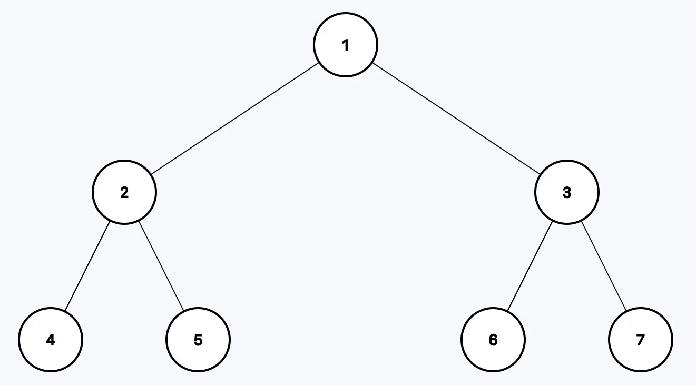

# Binary Tree Postorder Traversal

**Difficulty:** Easy

---

You are given the root of a binary tree, return the postorder traversal of its
nodes' values.

---

## Example 1:



```
Input: root = [1,2,3,4,5,6,7]
Output: [4,5,2,6,7,3,1]
```

---

## Example 2:


```
Input: root = [1,2,3,null,4,5,null]
Output: [4,2,5,3,1]
```

---

## Example 3:

```
Input: root = []
Output: []
```

---

## Constraints:

- 0 <= number of nodes in the tree <= 100
- -100 <= Node.val <= 100

---

## Follow up:

Recursive solution is trivial, could you

## Solution

```python
class Solution:
    def postorderTraversal(self, root: Optional[TreeNode]) -> List[int]:
        ans = []
        self.helper(root, ans)
        return ans


    def helper(self, node, ans):
        if not node:
            return

        self.helper(node.left, ans)
        self.helper(node.right, ans)
        ans.append(node.val)
```
