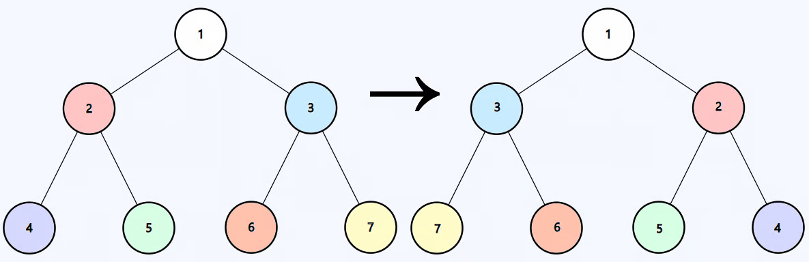
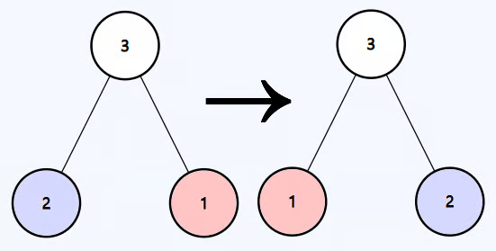

# Invert Binary Tree

You are given the root of a binary tree `root`. Invert the binary tree and
return its root.

---

## Example 1:



```
Input: root = [1,2,3,4,5,6,7]
Output: [1,3,2,7,6,5,4]
```

---

## Example 2:



```
Input: root = [3,2,1]
Output: [3,1,2]
```

---

## Example 3:

```
Input: root = []
Output: []
```

---

## Constraints:

- `0 <= The number of nodes in the tree <= 100`
- `-100 <= Node.val <= 100`

## Solution

Lets begin by asking ourselves the questions in [Main File](README.md)

1. What do I want from the either arm? -> Nothing
2. When I make the recursive call how am I going to use the information that I
   got from the my call ot the other arm. -> Don't need to worry about this
   since no information is passed up.
3. When recursive calls to both arms have finished, what information am I
   passing to the parent? -> Nothing

So we are simple swapping the children of a parent node, when that happens we do
the same for the childrens. Obviously Null node does not have any childrens so
no swapping can we done so we return when we encounter a None node.

```python
class Solution:
    def invertTree(self, root: Optional[TreeNode]) -> Optional[TreeNode]:
        if not root:
            return

        root.left , root.right = root.right, root.left
        self.invertTree(root.left)
        self.invertTree(root.right)

        return root
```

Easy Peazy right?

Furthermore whats insteresting is we did not write a helper function, we are
just working with one function. Even though our function does return something
at the end. to compeletely understand this desing Checkout
[Recursion](../Recursion/README.md). To save you a few clicks, when ever you
return some thing in a recursive call, you are pipeing the results back. On the
recieving end of this pipe is the place this recursive call was made. if you
dont store the value from recursive call you do nothing with the value. BUT! you
function was called my an external function. This external function is waiting
patientely on the recieving end while all the values returned from your
recursive calls goes in the drain.

This type of structure works best when you have to do some kind of tree surgery
and simply return the root.
