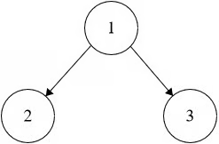
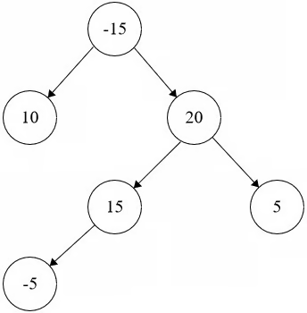

# Binary Tree Maximum Path Sum

**Difficulty:** Hard

---

Given the root of a non-empty binary tree, return the maximum path sum of any
non-empty path.

A path in a binary tree is a sequence of nodes where each pair of adjacent nodes
has an edge connecting them. A node cannot appear in the sequence more than
once. The path does not necessarily need to include the root.

The path sum of a path is the sum of the node's values in the path.

---

## Example 1:



```
Input: root = [1,2,3]
Output: 6
```

**Explanation:** The path is 2 -> 1 -> 3 with a sum of 2 + 1 + 3 = 6.

---

## Example 2:



```
Input: root = [-15,10,20,null,null,15,5,-5]
Output: 40
```

**Explanation:** The path is 15 -> 20 -> 5 with a sum of 15 + 20 + 5 = 40.

---

## Constraints:

- 1 <= The number of nodes in the tree <= 1000
- -1000 <= Node.val <= 1000

## Solution

```python
class Solution:
    def maxPathSum(self, root: Optional[TreeNode]) -> int:
        ans, _ = self.helper(root)
        return ans

    def helper(self, node):
        if not node:
            return float('-inf'), float('-inf')

        lmaxPath, lmaxArm = self.helper(node.left)
        rmaxPath, rmaxArm = self.helper(node.right)


        return max(lmaxPath, rmaxPath, node.val, node.val+lmaxArm+rmaxArm, \
        node.val + max(lmaxArm, rmaxArm)),\
            max(node.val, max(lmaxArm,rmaxArm) + node.val)
```
