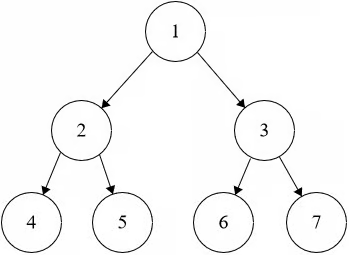

# Binary Tree Level Order Traversal

**Difficulty:** Medium

---

Given the root of a binary tree, return the level order traversal of its nodes'
values as a nested list, where each sublist contains the values of nodes at a
particular level in the tree, from left to right.

---

## Example 1:



```
Input: root = [1,2,3,4,5,6,7]
Output: [[1],[2,3],[4,5,6,7]]
```

---

## Example 2:

```
Input: root = [1]
Output: [[1]]
```

---

## Example 3:

```
Input: root = []
Output: []
```

---

## Constraints:

- 0 <= The number of nodes in the tree <= 1000
- -1000 <= Node.val <= 1000

## Solution

This is clearly a top down problem since the level is in context of the root, so
we need to pass down the level information from the root. As for returning the
result we can store the answers based on their current level in a datastrucutre,
we will use
[defaultdict](../Problem%20Solving%20Tips/python-for-prob-solving.md#data-strucutres-in-python)2

**Recursive Solution**

```python
from collections import defaultdict
class Solution:
    def levelOrder(self, root: Optional[TreeNode]) -> List[List[int]]:
        hmap = defaultdict(list)
        self.helper(root, 0, hmap)

        ans = []
        i = 0
        while i in hmap:
            ans.append(hmap[i])
            i+=1

        return ans


    def helper(self, node, level, hmap):
        if not node:
            return

        hmap[level].append(node.val)
        self.helper(node.left, level+1, hmap)
        self.helper(node.right, level+1, hmap)
```

**Iterative Solution**

```python
from collections import deque
from collections import defaultdict

class Solution:
    def levelOrder(self, root: Optional[TreeNode]) -> List[List[int]]:
        que = deque([])
        hmap = defaultdict(list)

        que.append([0, root])

        while que:
            l, node = que.popleft()
            if not node:
                continue
            hmap[l].append(node.val)

            que.append((l+1, node.left))
            que.append((l+1, node.right))

        ans = []
        i = 0

        while i in hmap:
            ans.append(hmap[i])
            i+=1

        return ans

```
