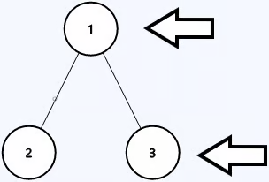
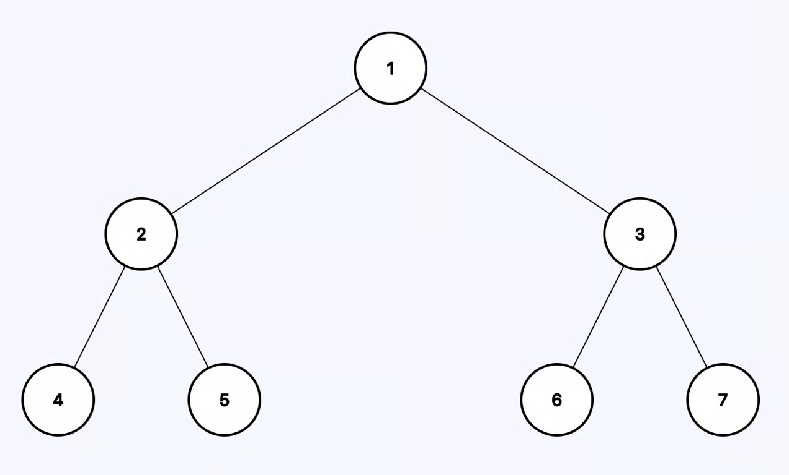

# 199. Binary Tree Right Side View

Given the root of a binary tree, imagine yourself standing on the right side of
it, return the values of the nodes you can see ordered from top to bottom.

---

## Example 1:



```
Input: root = [1,2,3,null,5,null,4]
Output: [1,3,4]
```

**Explanation:**  
From the right side, you can see nodes 1 (root), 3 (right child of root), and 4
(right child at bottom level).

---

## Example 2:



```
Input: root = [1,2,3,4,null,null,null,5]
Output: [1,3,4,5]
```

**Explanation:**  
You can see the rightmost node at each level of the tree.

---

## Example 3:

```
Input: root = [1,null,3]
Output: [1,3]
```

---

## Example 4:

```
Input: root = []
Output: []
```

---

## Constraints:

- The number of nodes in the tree is in the range [0, 100].
- -100 <= Node.val <= 100

## Solution.

We are looking at the tree from the right side, it is quite obvious that right
most arms length will block the lengths of view of all the arms behind them. And
its not the right most, its the longest arms before any arm.

This is a bottom approach, we can go down the right side of the tree find teh
height and then pass this height to the left side if there are any nodes beyond
this height we print/save else do nothing.

This problem is of the type when you actually need to send information from one
branch to another.

Lets start by answering the Bottom up questions.

1. What do I want from the either arm?
   - The number of nodes in that arm
2. When I make the recursive call how am I going to use the information that I
   got from the my call ot the other arm.
   - For the node on the left arm to be seen its height should be 1 + number of
     nodes on the right arm.
3. When recursive calls to both arms have finished, what information am I
   passing to the parent?
   - Max arm length
4. How does the current node contribute to this information I am building.
   - 1 + max Arm length

**DO NOT ZOOM OUT!!! STAY AT THE LEVEL OF COMPLETE TREE NODE, IT WILL ONLY
COMPLICATE THINGS, STAYING AT LEVEL WILL MAKE THE PROBLEM SO EASY, YOU WOULD
FEEL YOU ARE CHEATING, I PROMISE**

```python
class Solution:
    def rightSideView(self, root: Optional[TreeNode]) -> List[int]:
        ans = []
        self.helper(root, 0, ans)
        return ans


    def helper(self, node, block, ans):
        if not node:
            return 0

        if block <= 0:
            ans.append(node.val)

        right = self.helper(node.right, block-1, ans)
        left = self.helper(node.left, max(right + 1, block)-1, ans)

        return max(right, left) + 1
```
