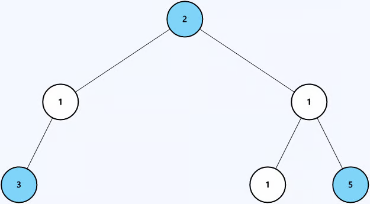

# Count Good Nodes in Binary Tree

**Difficulty:** Medium

---

Within a binary tree, a node x is considered good if the path from the root of
the tree to the node x contains no nodes with a value greater than the value of
node x.

Given the root of a binary tree root, return the number of good nodes within the
tree.

---

## Example 1:



```
Input: root = [2,1,1,3,null,1,5]
Output: 3
```

**Explanation:** There are 3 good nodes in the binary tree:

- Node with value 2 (root) is good as there are no nodes in its path with a
  greater value.
- Node with value 3 is good as nodes in its path (2,1,3) don't have a greater
  value than 3.
- Node with value 5 is good as nodes in its path (2,1,1,5) don't have a greater
  value than 5.

---

## Example 2:


```
Input: root = [1,2,-1,3,4]
Output: 4
```

**Explanation:** There are 4 good nodes in the binary tree.

---

## Constraints:

- 1 <= number of nodes in the tree <= 100
- -100 <= Node.val <= 100

## Solution

A node for it to know it is good it needs to know what is the maximum node value
that has been encountered along the way. So.. this means there is information
that needs to flow down. On the other hand we are condensing information from
the entire tree - this is "gives" bottom up structure.

So lets start the Bottom Up Questionnaire.

1. What do I want from the either arm?
   - The number of Good nodes
2. When I make the recursive call how am I going to use the information that I
   got from the my call ot the other arm.
   - Do not need to pass left arm answer to right arm just store it.
3. When recursive calls to both arms have finished, what information am I
   passing to the parent?
   - The total of the left and right arm.
4. How does the current node contribute to this information I am building.
   - If this is a good node add 1 to the result.

```python
class Solution:
    def goodNodes(self, root: TreeNode) -> int:
        return self.helper(root, -101)


    def helper(self, node, maxVal):
        if not node:
            return 0

        nval = max(maxVal, node.val)
        left = self.helper(node.left, nval)
        right = self.helper(node.right, nval)

        return left + right + (1 if node.val >= maxVal else 0)
```
