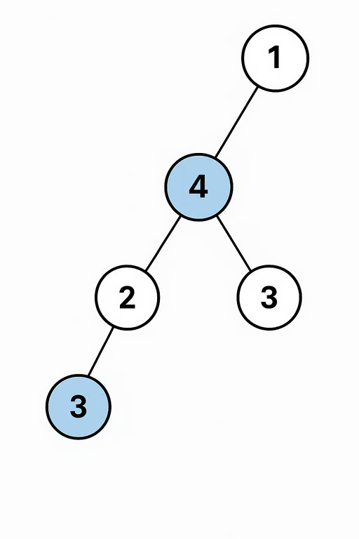
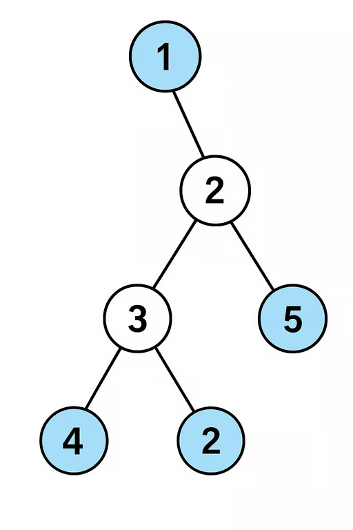

# TODO : House Robber III

The thief has found himself a new place for his thievery again. There is only
one entrance to this area, called root.

In this new place, there are houses and each house has its only one parent
house. All houses in this place form a binary tree. It will automatically
contact the police if two directly-linked houses were broken.

You are given the root of the binary tree, return the maximum amount of money
the thief can rob without alerting the police.

---

## Example 1:



```
Input: root = [3,2,3,null,3,null,1]
Output: 7
```

**Explanation:** Maximum amount of money the thief can rob = 3 + 3 + 1 = 7

---

## Example 2:



```
Input: root = [3,4,5,1,3,null,1]
Output: 9
```

**Explanation:** Maximum amount of money the thief can rob = 4 + 5 = 9

---

## Constraints:

- 1 <= The number of nodes in the tree <= 10,000
- 0 <= Node.val

## Solution.

**THIS IS AN IMPORTANT QUESTION**

You can see that we are condensing up information, this is screams bottom up
approach.

Unlike all the other questions we have done so far. Along with information from
either chlid , there is also an element of decision : no two connected nodes can
be selected.

This is how I attemted the first time around.

Here is how I answered the questionnaire.

1. What do I want from the either arm?
   - The best loot possible, and last selected node.
2. When I make the recursive call how am I going to use the information that I
   got from the my call ot the other arm.
   - Simply store it.
3. When recursive calls to both arms have finished, what information am I
   passing to the parent?
   - If the best loot has lastSelected node as the child itself. The answer
     could be one of the following .
     - sum of the max Loot from both the children.
     - If the current nodes value is more than this then just the node.
     - Check other chlid, if the best answer from there doesnt have it as the
       last selected then return the sum with that chlid branch if is it greates
4. How does the current node contribute to this information I am building.
   - Addressed in previous point.

That lead to this code.

```python
class Solution:
    def rob(self, root: Optional[TreeNode]) -> int:
        ans, _ = self.helper(root)
        return ans

    def helper(self, node):
        if not node:
            return 0, None

        lmax, lastnodeL = self.helper(node.left)
        rmax, lastnodeR = self.helper(node.right)

        if lastnodeL != node.left and lastnodeR != node.right:
            return node.val + lmax + rmax , node
        else:
            maxval = lmax + rmax
            prevNode = None

            if node.val > maxval:
                maxval, prevNode = node.val, node
            elif node.right != lastnodeR and node.val+rmax > maxval:
                maxval, prevNode = node.val + rmax, node
            elif node.left != lastnodeL and node.val+lmax > maxval:
                maxval, prevNode = node.val + lmax, node

            return maxval, prevNode
```

This fails for some test cases, especially the ones that have a situation like
this.

```
     10
   /   \
  3     1
         \
          7

```

Our logic does not give the current node the ability question, "Should I select
this child from this arm or not?". This is becase the way we answered our
questionair limited us. Lets try the questionnaire again.

1. What do I want from the either arm?
   - max value when I select the child, max value when I dont
2. When I make the recursive call how am I going to use the information that I
   got from the my call ot the other arm.
   - Store it
3. When recursive calls to both arms have finished, what information am I
   passing to the parent?
   - max value possible, and the last node selected.
4. How does the current node contribute to this information I am building.
   - max (curr + sum of max value of both arm with child, sum of max value of
     both arm with child)

```python
class Solution:
    def rob(self, root: Optional[TreeNode]) -> int:
        a, b = self.helper(root)

        return max(a, b)

    def helper(self, node):
        if not node:
            return 0 , 0

        l = self.helper(node.left)
        r = self.helper(node.right)


        return l[1]+r[1]+node.val , max(l) + max(r)
```
