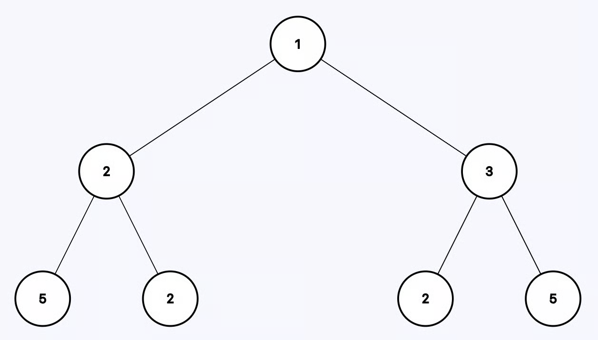
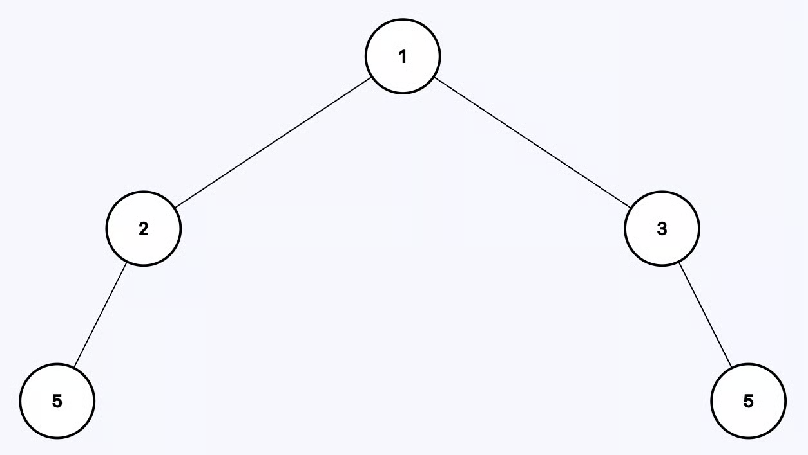
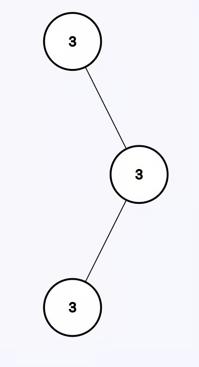

# Delete Leaves With a Given Value

You are given a binary tree `root` and an integer `target`, delete all the leaf
nodes with value `target`.

Note that once you delete a leaf node with value `target`, if its parent node
becomes a leaf node and has the value `target`, it should also be deleted (you
need to continue doing that until you cannot).

---

## Example 1:

 

```
Input: root = [1,2,3,5,2,2,5], target = 2
Output: [1,2,3,5,null,null,5]
```

---

## Example 2:



```
Input: root = [3,null,3,3], target = 3
Output: []
```

**Explanation:** The output is an empty tree after removing all the nodes with
value 3.

---

## Constraints:

- 1 <= number of nodes in the tree <= 3000
- 1 <= Node.val, target <= 1000

## Solution

```python
class Solution:
    def removeLeafNodes(self, root: Optional[TreeNode], target: int) -> Optional[TreeNode]:
        if not root:
            return None

        root.left = self.removeLeafNodes(root.left, target)
        root.right = self.removeLeafNodes(root.right, target)


        if not root.left and not root.right and root.val == target:
            root = None

        return root
```
