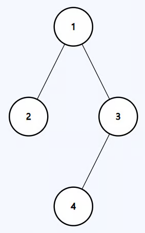

# Maximum Depth of Binary Tree

Given the root of a binary tree, return its depth.

The depth of a binary tree is defined as the number of nodes along the longest
path from the root node down to the farthest leaf node.

---

## Example 1:



```
Input: root = [1,2,3,null,null,4]
Output: 3
```

---

## Example 2:

```
Input: root = []
Output: 0
```

---

## Constraints:

- `0 <= The number of nodes in the tree <= 100`
- `-100 <= Node.val <= 100`

## Solution

Like all our tree questions we start with the questions

1. What do I want from the either arm? -> Height (number of nodes under them)
2. When I make the recursive call how am I going to use the information that I
   got from the my call ot the other arm. -> Store it so that we can compare
   which arm is the longest.
3. When recursive calls to both arms have finished, what information am I
   passing to the parent? -> maximum of the two values I get back.
4. How does the current node contribute to this information I am building. ->
   1 + the maxheight from the children - since form the context of its parent
   our current node is also adding to the height.

```python
class Solution:
    def maxDepth(self, root: Optional[TreeNode]) -> int:
        if not root:
            return 0

        lHeight = self.maxDepth(root.left)
        rHeight = self.maxDepth(root.right)

        return max(lHeight, rHeight) + 1
```
