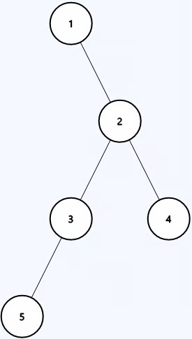

Diameter of Binary Tree The diameter of a binary tree is defined as the length
of the longest path between any two nodes within the tree. The path does not
necessarily have to pass through the root.

The length of a path between two nodes in a binary tree is the number of edges
between the nodes.

Given the root of a binary tree root, return the diameter of the tree.

Example 1:  Input: root = [1,null,2,3,4,5]

Output: 3 Explanation: 3 is the length of the path [1,2,3,5] or [5,3,2,4].

Example 2:

Input: root = [1,2,3]

Output: 2 Constraints:

1 <= number of nodes in the tree <= 100 -100 <= Node.val <= 100

## Solution

1. What do I want from the either arm? -> max Number of nodes below it aka
   height
2. When I make the recursive call how am I going to use the information that I
   got from the my call ot the other arm. Store
3. When recursive calls to both arms have finished, what information am I
   passing to the parent? combining the two height to form a diameter
4. How does the current node contribute to this information I am building. 1 +
   to the sum of the height.

**NOTE** : Notice how theres a mismatch of information we are expecting to get
form the children and the information we are returning to our parent? Which one
is right then? - Both of them, we want to the maximum height from each node but
we also want them to tell us whats the biggest diameter they were able to make.
So we return two things.

But now every arm gives us a height and a diameter. we also return diameter
along with the height, so which diameter do we actually return ? The question
asks us the maximum possible diameter right? so max of all the diameter that we
have - left diameter, right diameter, and the diameter we just calculated from
the heights.

```python
class Solution:
    def diameterOfBinaryTree(self, root: Optional[TreeNode]) -> int:
        _ , d = self.helper(root)
        return d


    def helper(self, node):
        if not node:
            return 0, 0

        lh, ld = self.helper(node.left)
        rh, rd = self.helper(node.right)

        return max(lh, rh)+1,max((lh+rh), ld, rd)
```
