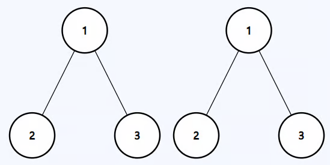
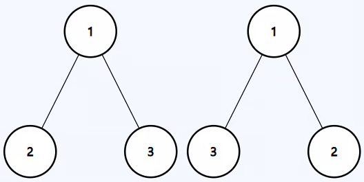

# Same Binary Tree

Given the roots of two binary trees p and q, return true if the trees are
equivalent, otherwise return false.

Two binary trees are considered equivalent if they share the exact same
structure and the nodes have the same values.

---

## Example 1:



```
Input: p = [1,2,3], q = [1,2,3]
Output: true
```

---

## Example 2:


```
Input: p = [4,7], q = [4,null,7]
Output: false
```

---

## Example 3:



```
Input: p = [1,2,3], q = [1,3,2]
Output: false
```

---

## Constraints:

- 0 <= The number of nodes in both trees <= 100
- -100 <= Node.val <= 100

## Solution

1. What do I want from the either arm? - It is the same binary tree down there?
2. When I make the recursive call how am I going to use the information that I
   got from the my call ot the other arm. - Store it.
3. When recursive calls to both arms have finished, what information am I
   passing to the parent? - And of results of both arms.
4. How does the current node contribute to this information I am building. is
   the current node also equal ?

```python
class Solution:
    def isSameTree(self, p: Optional[TreeNode], q: Optional[TreeNode]) -> bool:
        if not p or not q:
            if p or q:
                return False
            else:
                return True

        left = self.isSameTree(p.left, q.left)
        right = self.isSameTree(p.right, q.right)


        if left and right:
            return p.val == q.val

        return False
```

Make sure to look at the solution to see if you can optimize it further. we can
move the checking of current node before we go down an explore teh subtrees.

```python
class Solution:
    def isSameTree(self, p: Optional[TreeNode], q: Optional[TreeNode]) -> bool:
        if not p or not q:
            if p or q:
                return False
            else:
                return True

        if p.val == q.val:
            left = self.isSameTree(p.left, q.left)
            right = self.isSameTree(p.right, q.right)
            return left and right
        else:
            return False


```
