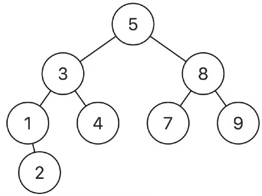

# Lowest Common Ancestor in Binary Search Tree

---

Given a binary search tree (BST) where all node values are unique, and two nodes
from the tree p and q, return the lowest common ancestor (LCA) of the two nodes.

The lowest common ancestor between two nodes p and q is the lowest node in a
tree T such that both p and q as descendants. The ancestor is allowed to be a
descendant of itself.

---

## Example 1:



```
Input: root = [5,3,8,1,4,7,9,null,2], p = 3, q = 8
Output: 5
```

---

## Example 2:


```
Input: root = [5,3,8,1,4,7,9,null,2], p = 3, q = 4
Output: 3
```

**Explanation:** The LCA of nodes 3 and 4 is 3, since a node can be a descendant
of itself.

---

## Constraints:

- 2 <= The number of nodes in the tree <= 100
- -100 <= Node.val <= 100
- p != q
- p and q will both exist in the BST.

## Solution.

Lets for now ignore the fact that this is a binary search tree and just treat it
like a tree and try if can write a recursive solution using the four questions.

1. What do I want from the either arm

   - did you find either of the nodes?

2. When I make the recursive call how am I going to use the information that I
   got from the my call ot the other arm.
   - Store it dont need to pass it down the other arm since we are a common
     ancestor, if one node of found at current nodes child, the common ancester
     is either current node or above.
3. When recursive calls to both arms have finished, what information am I
   passing to the parent?
   - If both nodes are found say current node is the common ancestor.
4. How does the current node contribute to this information I am building.
   - No contribution.

Look at the things we are returning.

1. did we find node 1
2. did we find node 2
3. common ancestor

we need to rethink about what our recursion returns so that we can include all
these elements.

```python
class Solution:
    def lowestCommonAncestor(self, node: TreeNode, p: TreeNode, q: TreeNode) -> TreeNode:
        _, _, node = self.helper(root, p, q)
        return node

    def helper(self, node, p, q):
        if node is None:
            return False, False, None

        l1, l2, l3 = self.helper(node.left, p, q)

        if l3:
            return True, True, l3

        r1, r2, r3 = self.helper(node.right, p, q)

        if r3:
            return True, True, r3

        if (l1 and r2) or (l2 and r1) or \
        ((node.val == p.val and (l2 or r2)) or ((node.val == q.val) and (r1 or l1))):
            return True, True, node
        else:
            return l1 or r1 or node.val == p.val,l2 or r2 or node.val == q.val, None
```

This works but lets now factor in that we are dealing with a Binary Search Tree.

```python
class Solution:
    def lowestCommonAncestor(self, node: TreeNode, p: TreeNode, q: TreeNode) -> TreeNode:
        if min(p.val, q.val) > node.val:
            return self.lowestCommonAncestor(node.right, p, q)
        elif max(q.val, p.val) < node.val:
            return self.lowestCommonAncestor(node.left, p, q)
        else:
            return node
```
