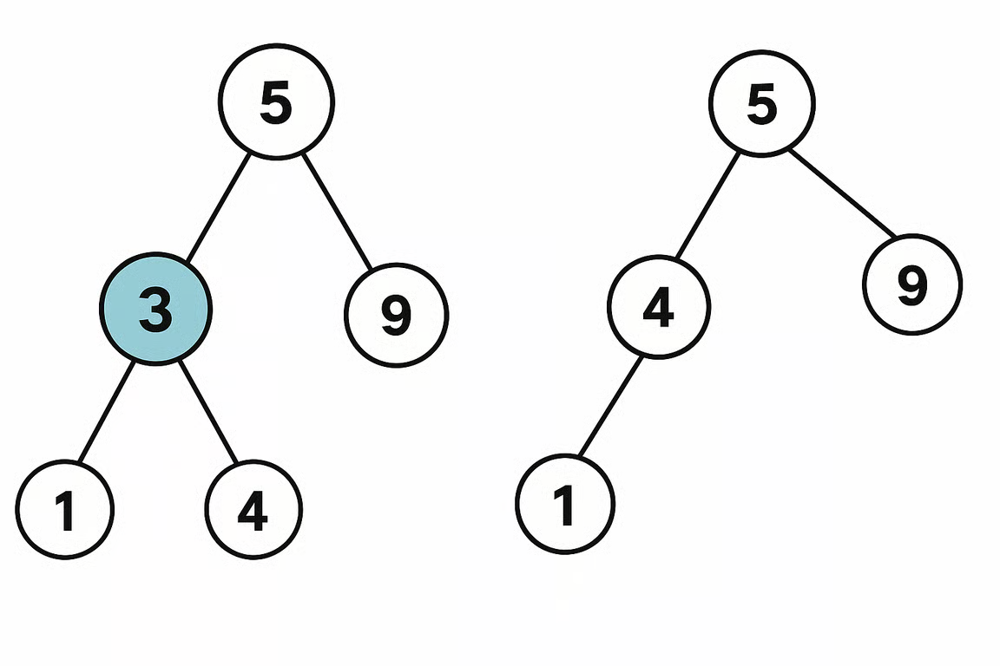
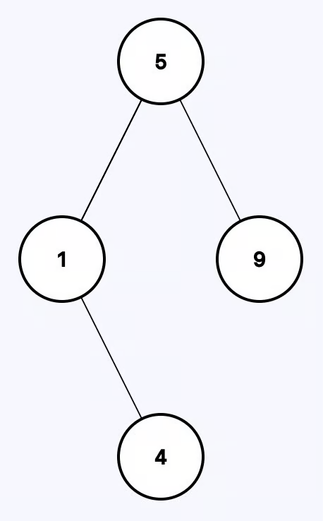

# Delete Node in a BST

You are given a root node reference of a BST and a key, delete the node with the
given key in the BST, if present. Return the root node reference (possibly
updated) of the BST.

Basically, the deletion can be divided into two stages:

1. Search for a node to remove.
2. If the node is found, delete the node.

**Note:** There can be multiple results after deleting the node, return any one
of them.

---

## Example 1:



```
Input: root = [5,3,9,1,4], key = 3
Output: [5,4,9,1]
```

**Explanation:** Another valid answer is:



---

## Example 2:


```
Input: root = [5,3,6,null,4,null,10,null,null,7], key = 3
Output: [5,4,6,null,null,null,10,7]
```

---

## Constraints:

- 0 <= The number of nodes in the tree <= 10,000
- -100,000 <= key, Node.val <= 100,000
- All the values Node.val are unique.

## Solution

There are two stages to the problem, like they have generously metioned in the
questions.

1. Find the node
2. Delete the node

We would want to ask/check if it is guaranteed that the node exists. Searching
is straight forward but..BUT the main chuck of this problem is deleting the
node.
